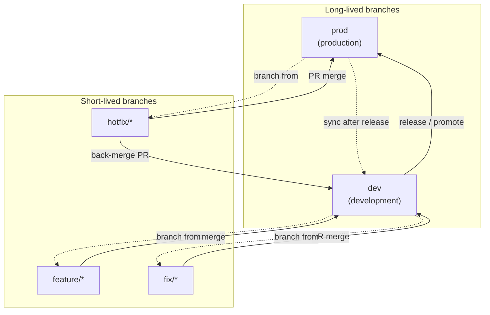
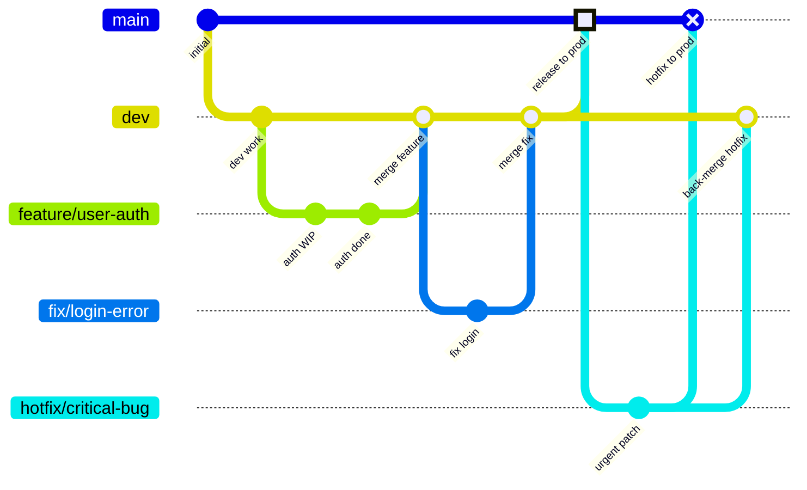

# Git Workflow

This repository uses a **prod / dev** branching model. All day-to-day work happens on `dev`. `prod` holds production-ready code only.

## Branch overview

| Branch | Purpose | Who merges here |
|--------|---------|-----------------|
| `prod` | Production-ready, deployable code | Hotfixes only (via PR) |
| `dev` | Integration branch for ongoing development | Features, fixes, and hotfix back-merges |
| `feature/*` | New functionality | → `dev` |
| `fix/*` | Bug fixes (non-urgent) | → `dev` |
| `hotfix/*` | Urgent production fixes | → `prod`, then back to `dev` |

## Workflow diagram



## Branch lifecycle



> **Note:** In the git graph above, `main` represents `prod` (Mermaid's `gitGraph` uses `main` as the default first branch name).

## Rules

### Feature branches → `dev`

Use for new functionality, refactors, and non-urgent improvements.

```bash
git checkout dev
git pull origin dev
git checkout -b feature/short-description
# ... work, commit ...
git push -u origin feature/short-description
# Open PR: base = dev, compare = feature/short-description
```

**Naming:** `feature/add-property-search`, `feature/dashboard-ui`

### Fix branches → `dev`

Use for bugs found during development or in non-production environments.

```bash
git checkout dev
git pull origin dev
git checkout -b fix/broken-filter
# ... work, commit ...
git push -u origin fix/broken-filter
# Open PR: base = dev, compare = fix/broken-filter
```

**Naming:** `fix/map-marker-crash`, `fix/validation-message`

### Hotfix branches → `prod` (then back to `dev`)

Use only for **urgent production issues** that cannot wait for the next release from `dev`.

```bash
git checkout prod
git pull origin prod
git checkout -b hotfix/payment-timeout
# ... work, commit ...
git push -u origin hotfix/payment-timeout
# Open PR #1: base = prod, compare = hotfix/payment-timeout
# After merge to prod, open PR #2: base = dev, compare = hotfix/payment-timeout (or prod)
```

**Naming:** `hotfix/security-patch`, `hotfix/checkout-error`

Always back-merge the hotfix into `dev` so the fix is not lost in the next release.

### Releasing `dev` → `prod`

When `dev` is stable and ready for production:

```bash
git checkout prod
git pull origin prod
git merge dev
git push origin prod
```

Prefer a **pull request** from `dev` into `prod` for review and a clear audit trail.

## Pull request checklist

| Branch type | Base branch | Merge target |
|-------------|-------------|--------------|
| `feature/*` | `dev` | `dev` |
| `fix/*` | `dev` | `dev` |
| `hotfix/*` | `prod` | `prod`, then `dev` |
| Release | `prod` | merge `dev` → `prod` |

## Quick reference

```
prod  ─────────────────────────────────────────────►  (production)
  ▲                           ▲
  │ hotfix/*                  │ release (dev → prod)
  │                           │
  └── hotfix/* ──► back-merge to dev

dev   ─────────────────────────────────────────────►  (integration)
  ▲           ▲
  │           │
  feature/*   fix/*
```

## Fork policy

Forking is **disabled where GitHub allows it** (organization-owned private repositories). This is a **public personal repository**, so GitHub does not offer a fork ban setting for this repo type. Use is further restricted by the [LICENSE](../LICENSE) (all rights reserved, no commercial use).
